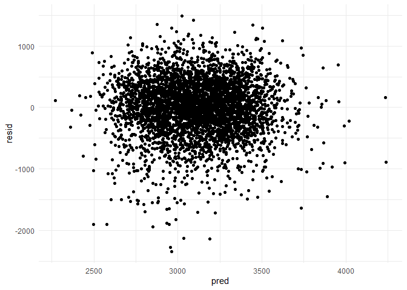
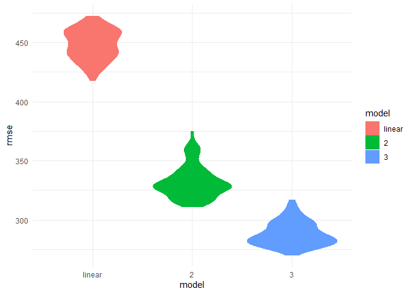
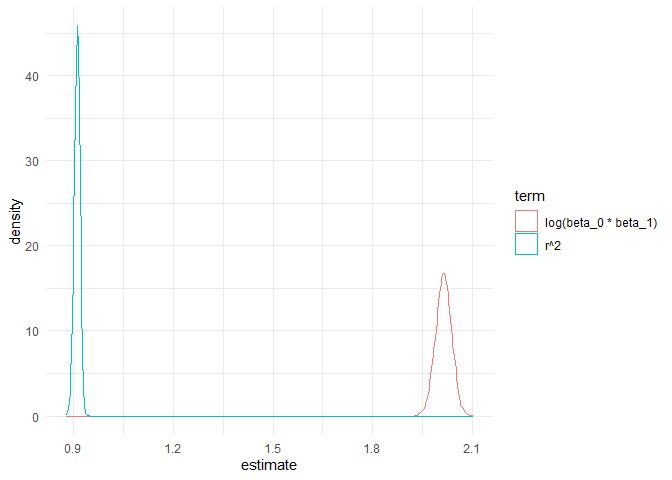

p8105\_hw6\_lg3158
================
Ling
11/27/2021

## Problem 1

-   Data cleaning
    -   transform categorical variables as factor
        (`babysex`,`frace`,`malform`,`mrace`)
    -   check for missing values

``` r
p1 = read_csv("https://www.p8105.com/data/birthweight.csv",
              col_names = TRUE) %>%
  mutate(babysex = recode_factor(as_factor(babysex), "1" = "male","2" = "female"),
         frace = recode_factor(as_factor(frace), "1" = "White", "2" = "Black", "3" = "Asian", "4" = "Puerto Rican", "8" = "Other", "9" = "Unknown"),
         malform = recode_factor(as_factor(malform), "1" = "present", "0" = "absent"),
         mrace = recode_factor(as_factor(mrace), "1" = "White", "2" = "Black", "3" = "Asian", "4" = "Puerto Rican", "8" = "Other"))
```

    ## Rows: 4342 Columns: 20

    ## -- Column specification --------------------------------------------------------
    ## Delimiter: ","
    ## dbl (20): babysex, bhead, blength, bwt, delwt, fincome, frace, gaweeks, malf...

    ## 
    ## i Use `spec()` to retrieve the full column specification for this data.
    ## i Specify the column types or set `show_col_types = FALSE` to quiet this message.

``` r
anyNA(p1)
```

    ## [1] FALSE

-   Data description
    -   there are 20 variables and 4342 observations in the data set,
        without any missing values.
-   Regression model
    -   by common sense, gestational age in weeks, baby’s head
        circumference and length at birth are associated with birth
        weight, though these are not clinically meaningful.
    -   thus, drop `bhead`, `blength`, and `gaweeks` and use the
        remained variables to construct the linear regression model
        using step-wise selection (forward process).
    -   rerun the model using `lm`.
    -   produce the plot of model residuals against fitted values.

``` r
p1_reg = p1 %>%
         select(-c(bhead, blength, gaweeks))

intercept_only_p1 = lm(bwt ~ 1, data = p1_reg)
full_p1 = lm(bwt ~ ., data = p1_reg)
forward_p1 = step(intercept_only_p1, direction = "forward", scope = formula(full_p1), trace = 0)

foward_anova = as_tibble(forward_p1$anova)
p1_reg_summary = p1_reg %>%
  lm(bwt ~ mrace + delwt + smoken + ppbmi + babysex + ppwt + mheight + fincome, data = .)

p1_reg %>%
  modelr::add_residuals(p1_reg_summary) %>%
  modelr::add_predictions(p1_reg_summary) %>%
  ggplot(aes(x = pred, y = resid)) +
    geom_point() +
    theme_minimal()
```

<!-- -->

-   Cross validation

``` r
cv_df = crossv_mc(p1 , 100) %>%
  mutate(train = map(train, as_tibble),
         test = map(test, as_tibble),
         p1_linear = map(train, ~lm(bwt ~ mrace + delwt + smoken + ppbmi + babysex + ppwt + mheight + fincome, data = .)),
         p1_2 = map(train, ~ lm (bwt ~ blength + gaweeks, data = .)),
         p1_3 = map(train, ~ lm (bwt ~ bhead + blength + babysex + bhead*babysex + blength*babysex + bhead*blength, data = .)),
         rmse_linear = map2_dbl(p1_linear, test, ~ rmse(model = .x, data = .y)),
         rmse_2 = map2_dbl(p1_2, test, ~ rmse(model = .x, data = .y)),
         rmse_3 = map2_dbl(p1_3, test, ~ rmse(model = .x, data = .y))) %>%
  select(starts_with('rmse')) %>%
  pivot_longer(
    everything(),
    names_to = "model",
    values_to = "rmse",
    names_prefix = "rmse_") %>%
  mutate(model = fct_inorder(model)) %>%
  ggplot(aes(x = model, y = rmse, fill = model, color = model)) + 
    geom_violin() +
    theme_minimal()

cv_df
```

<!-- -->

-   From the violin plot we can see that the model using head
    circumference, length, sex and all the interactions has the minimal
    rmse, indicating that this model fits the data best among all 3
    models.

## problem 2

-   Steps:
    -   import the data using the given code chunk
    -   bootstrap and data wrangling the results
        -   the summary data for bootstrap is named as `bootstrap`
        -   create 5000 bootstrap samples
        -   use `map` to create the estimates
            -   log(beta\_0 \* beta\_1) is in `results` list
            -   r^2 is in `rsquares` list
        -   data wrangling
            -   unnest the `results` list, keep the variable `term` and
                `estimate`
            -   transform the `intercept` and `tmin` into wider format
            -   calculate log(beta\_0 \* beta\_1), the result variable
                is named as `log_betas`
            -   unnest the `rsquare` list, extract `r_squared` variable
    -   density plot (named as `bootstrap_density`)
        -   transform the `bootstrap` data into long form, in which:
            -   `term`: whether the variable is `log_betas` or
                `r_squared`
            -   `estimate`: the estimated values
        -   create the density plot, group by `term`

``` r
weather_df = 
  rnoaa::meteo_pull_monitors(
    c("USW00094728"),
    var = c("PRCP", "TMIN", "TMAX"), 
    date_min = "2017-01-01",
    date_max = "2017-12-31") %>%
  mutate(
    name = recode(id, USW00094728 = "CentralPark_NY"),
    tmin = tmin / 10,
    tmax = tmax / 10) %>%
  select(name, id, everything())
```

    ## Registered S3 method overwritten by 'hoardr':
    ##   method           from
    ##   print.cache_info httr

    ## using cached file: C:\Users\lakas\AppData\Local/Cache/R/noaa_ghcnd/USW00094728.dly

    ## date created (size, mb): 2021-10-05 10:32:36 (7.617)

    ## file min/max dates: 1869-01-01 / 2021-10-31

``` r
bootstrap = weather_df %>%
  modelr::bootstrap(n = 5000) %>%
  mutate(
    models = map(strap, ~ lm (tmax ~ tmin, data = .x)),
    results = map(models, broom::tidy),
    rsquares = map(models, broom::glance)
    ) %>%
  select(results, rsquares) %>%
  unnest(results) %>%
  select(term, estimate, rsquares) %>%
  pivot_wider(names_from = term, values_from = estimate) %>%
  unnest(rsquares) %>%
  janitor::clean_names() %>%
  select(intercept, tmin, r_squared) %>%
  mutate(log_betas = log(intercept * tmin))

bootstrap_density = bootstrap %>%
  select(-intercept, -tmin) %>%
  pivot_longer(cols = c(log_betas, r_squared), names_to = "term", values_to = "estimate") %>%
  ggplot(aes(x = estimate, group = term, color = term)) +
    geom_density() +
    theme_minimal() +
    scale_color_discrete(labels = c("log(beta_0 * beta_1)", "r^2"))

bootstrap_density
```

<!-- -->

-   Description of the density plot
    -   the 2 values are approximately normally distributed, with
        different means
    -   the mean of r^2 is larger than the mean of log(beta\_0 \*
        beta\_1) (2 vs. 0.9)
    -   the range of log(beta\_0 \* beta\_1) is narrower than r^2
-   calculate 95% CI (named as `bootstrap_summary`)
    -   transform the `bootstrap` data into long form, in which:
        -   `term`: whether the variable is `log_betas` or `r_squared`
        -   `estimate`: the estimated values
        -   create the density plot, group by `term`

``` r
bootstrap_summary = bootstrap %>%
  select(-intercept, -tmin) %>%
  pivot_longer(cols = c(log_betas, r_squared), names_to = "term", values_to = "estimate") %>%
  group_by(term) %>%
  summarize(ci_lower = quantile(estimate, 0.025),
          ci_upper = quantile(estimate, 0.975))

knitr::kable(bootstrap_summary, digits = 3)
```

| term       | ci\_lower | ci\_upper |
|:-----------|----------:|----------:|
| log\_betas |     1.966 |     2.058 |
| r\_squared |     0.894 |     0.927 |
